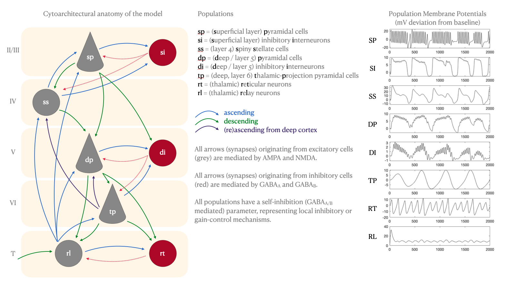

# atcm
extended thalamo-cortical neural mass model for M/EEG

This matlab toolbox includes implementations of extended 
-cortical and thalamo-cortical neural mass models using Morris-Lecar-like equations.
 It further provides functions for performing numerical integration 
of the models, including many options around input type, integration algorithm method,
modal time series decomposition, spectral response / transfer functions, singular 
spectrum analysis and more.

It further includes functions for plotting, extracting parameters and example
application scripts. It integrates easily into the Dynamic Causal Modelling framework 
and can be optimised/ inverted using AO.m from my aoptim toolbox. 

To get started, see NewRunSZ.m - a script which applied the model to single-channel virtual 
electrode data from an MEG study using visual gratings to induce gamma oscillations in V1, and
which compares the effects of ketamine vs placebo administration.

